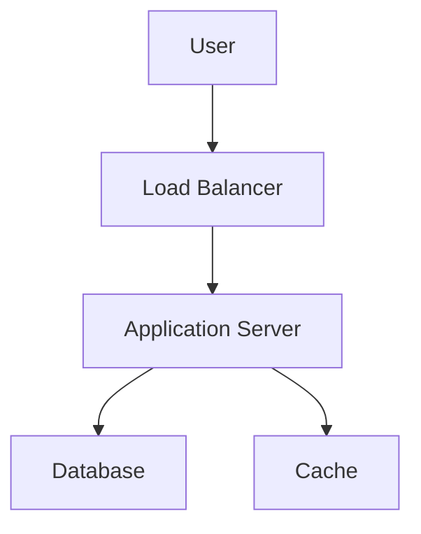

# Architecture Diagram



---

### Étape 4 : Ajouter des commentaires pour Copilot

Ajoutez des commentaires dans chaque fichier pour demander à Copilot d'améliorer ou d'étendre les sections. Par exemple :

```markdown
# TODO: Add more details about scaling the architecture in the diagram
```
